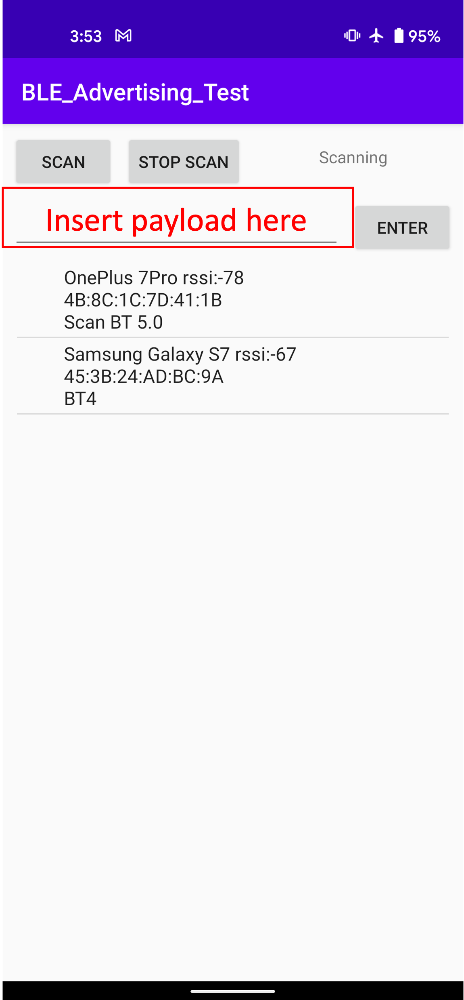

# BLE-Advertising-Test-App
This app allows android devices to broadcast BLE manufacturer specific payload and allows devices to scan and display nearby BLE manufacturer specific payload.
# Develop

## Built With

This app was built using 
1. Android Studio Bumblebee | 2021.1.1 Patch 2.
2. SDK Platform Android 11.0 (R)
3. Kotlin Plugin version 211-1.6.10

## Prerequisites
This app requires Android Studio, Java and Kotlin to be installed in the system.
https://developer.android.com/studio
# Run App
## Permissions
The following permissions are required to be granted by the user to allow BLE Advertising and Scanning.
1. uses-permission android:name="android.permission.BLUETOOTH"
2. uses-permission android:name="android.permission.BLUETOOTH_ADMIN"
3. uses-permission android:name="android.permission.ACCESS_COARSE_LOCATION"
4. uses-permission android:name="android.permission.ACCESS_FINE_LOCATION"

## Functions
### private fun saveScanResult()
This function saves the scan records received during the scanning for nearby BLE devices and saves them to a arrayList. The arrayList will be retrived and displayed on the app screen to show the scan records.

The following information will be saved in the arraylist and subsequently displayed on the app screen.
1. Device Name
2. RSSI 
3. Manufacturer Specific payload

### private fun startScanLeDevice()
This function starts the scanning function for nearby BLE device. The function includes the ScanSettings.builder() which allows the settings of the scan frequency to be set.

### private fun startAdvertising()
This function starts the advertising function to allow other devices to scan for this device advertising payload. This function includes AdvertiseSettings.Builder() which allows specific BLE advertising function to be set. 

## Set Manufacturer Specific Payload
1. Edit the textfield in the app to set manufacturer specific payload shown in the image below

3. Alternatively, the payload can be set within the app under the function 'private fun startAdvertising'
>        val advertiseData = AdvertiseData.Builder()
>        .addManufacturerData(
>        GENERAL,
>        buildPayload(editText_data!!.text.toString()) // Set Manufacturer Specific Payload
>        )
>        .addServiceUuid(ParcelUuid.fromString("0000b81d-0000-1000-8000-00805f9b34fb"))
>        .setIncludeDeviceName(false) // Set if device name should be included in the advertising payload
>        .build()

The manufacturer specific payload allows a maximum of 24 bytes to be transmitted when device name is not included within the advertising payload.

## Set Advertising Frequency, Connectable, Advertising Range
The advertising frequency can be set within the app under the function 'private fun startAdvertising'
>        val settings = AdvertiseSettings.Builder()
>        .setAdvertiseMode(AdvertiseSettings.ADVERTISE_MODE_LOW_LATENCY) // Set Advertising Frequency
>        .setConnectable(false) //Set True if device is allowed to be connected using bluetooth
>        .setTimeout(0)
>        .setTxPowerLevel(AdvertiseSettings.ADVERTISE_TX_POWER_HIGH) //Set Advertising Range
>        .build()

The following parameters are allowed for the Advertising Frequency setting
1. AdvertiseSettings.ADVERTISE_MODE_LOW_LATENCY
2. AdvertiseSettings.ADVERTISE_MODE_BALANCED
3. AdvertiseSettings.ADVERTISE_MODE_LOW_POWER

The following parameters are allowed for the Advertising Range setting
1. AdvertiseSettings.ADVERTISE_TX_POWER_HIGH
2. AdvertiseSettings.ADVERTISE_TX_POWER_BALANCED
3. AdvertiseSettings.ADVERTISE_TX_POWER_LOW

## Set Scan Frequency
The Scan frequency can be set within the app under the function 'private fun startScanLeDevice()'
>        val settings = ScanSettings.Builder()
>        .setScanMode(ScanSettings.SCAN_MODE_LOW_LATENCY) // Set Scan Frequency
>        .setReportDelay(reportDelay.toLong())
>        .build()
>        mBluetoothLeScanner!!.startScan(null, settings, mScanCallback)
>        textView_info!!.text = resources.getString(R.string.bt_scanning)

The following paremeters are allowed for the Scan Frequency Settings
1. ScanSettings.SCAN_MODE_LOW_LATENCY
2. ScanSettings.SCAN_MODE_BALANCED
3. ScanSettings.SCAN_MODE_LOW_POWER

## Access Log Files
The Log files are saved in the mobile device. To access the log file, navigate to 
1. View -> Tools Window -> Device File Explorer
2. Locate the app under com.example.ble_advertising
3. The log file label config.txt can be found in the files folder.

# API References
1. https://source.android.com/devices/bluetooth/ble_advertising
2. https://developer.android.com/reference/android/bluetooth/le/BluetoothLeAdvertiser
3. https://developer.android.com/reference/android/bluetooth/le/AdvertiseData
4. https://developer.android.com/reference/android/bluetooth/le/BluetoothLeScanner
5. https://developer.android.com/guide/topics/connectivity/bluetooth/find-ble-devices
